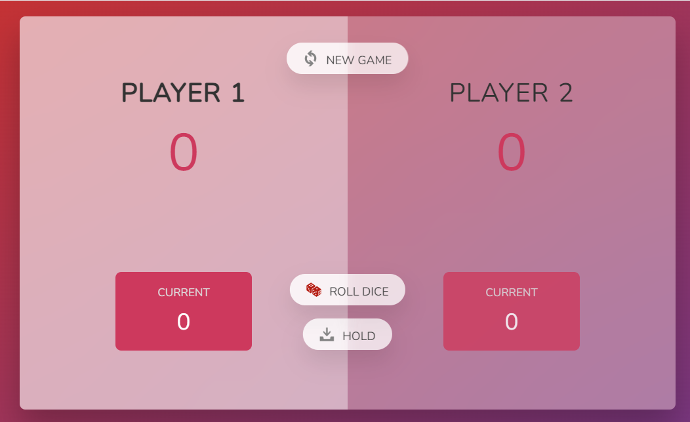
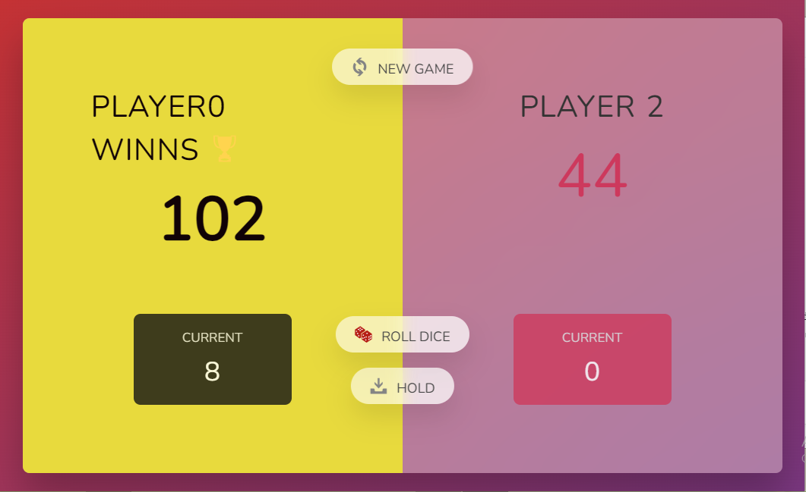

# 🎲 Pig Game

A fun two-player dice game built with **HTML**, **CSS**, and **JavaScript**.  
The first player to reach **100 points** wins! 🏆

---

## 📖 How to Play
1. The game starts with **Player 1**.
2. On their turn, the player can:
   - 🎲 **Roll the dice**: The rolled number is added to their **current score**.  
     - ⚠️ But if the dice shows **1**, the current score is lost and the turn switches to the other player.
   - 📥 **Hold**: The current score is added to their **total score**, and the turn switches to the other player.
3. The first player to reach **100 points** wins the game. 🎉

---

## 🕹️ Controls
- **🎲 Roll dice** → Add points to current score.  
- **📥 Hold** → Save current score and pass the turn.  
- **🔄 New Game** → Reset everything and start again.  

---

## 💻 Technologies Used
- **HTML5** → Structure of the game.  
- **CSS3** → Styling, layout, and game visuals.  
- **Vanilla JavaScript (ES6)** → Game logic and interactivity.  

---

## 🚀 How to Run
1. Download or clone this repository.
2. Open the `index.html` file in any modern browser.
3. Play with a friend and have fun! 🎉

---

## ✨ Features
- Smooth UI with CSS animations.  
- Dynamic dice images.  
- Winner highlight with a gold background.  
- Reset and start a fresh game anytime.  

---

## 📌 Future Improvements
- Add **custom winning score** input.  
- Add **player names input** instead of default names.  
- Mobile-friendly responsive design.  

---
## 🎮 Game Screenshot

